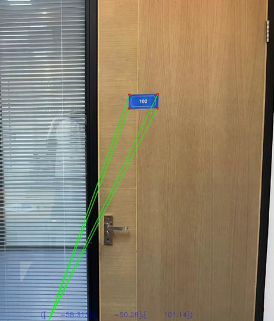
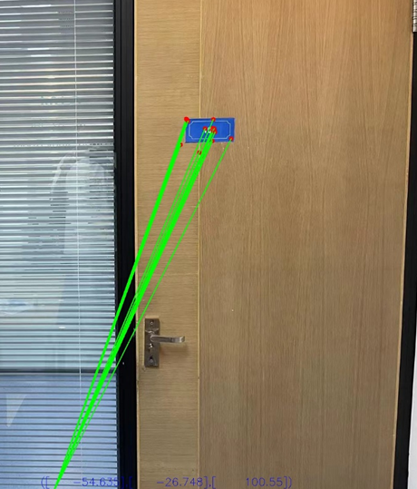
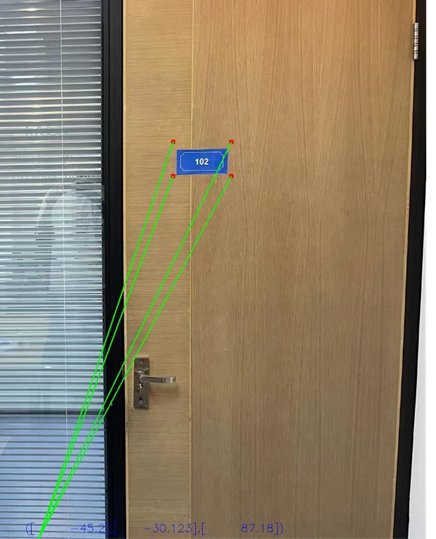

# **Camera Pose Estimation Based on Object Recognition**

## Library

numpy                   1.23.1

opencv-contrib-python   4.4.0.42

opencv-python           4.4.0.42


## How to use

process_corner.py is the main process of pose estimation.

The process_corner has three method: 

corner detection -> method0; 

SIFT -> method1;

bounding box -> method2

The default method is corner detection. And change the number of method can switch the processing method.

```python
method = 0
#0 1 2
```


Testing images are stored in "/origin_img/measureddata"

And related object data files are stored in  "/origin_img/measureddata/data" 

Template images for SIFT are stored in "/template"

```python
data_path = "origin_img/measureddata/img5.jpg"
template = cv2.imread('template/card1.jpg.jpg', 0)
lable_path = "origin_img/measureddata/data/data5.txt"
```

When testing, changing the img number from 3 to 10 and the related data number from 3 to 10. The testing image contains different distance of the same reference object.


If you want to switch the corner detection method between ours and opencv, please uncomment one  and comment the other one.

```python
#ours
#corners = corner.my_good_featuressToTrack(edges, maxCorners=30, qualityLevel=0.01, minDistance=30, mask=mask)
#opencv
corners = cv2.goodFeaturesToTrack(edges, maxCorners=30, qualityLevel=0.01, minDistance=30, mask=mask)
```

 

Notice: To simplify the testing process, the data file contains the information detected by yolov8. If you want to use the trained network to detect please install the ultralytics, torch, torchvision first, and uncomment the following code:

```python
# model = YOLO("E:/Yolo/ultralytics/runs/detect/train13/weights/best.pt")  # 加载预训练的 YOLOv8n 模型
# results = model(data_path)  # predict on an image
# lable_path = results[0].names
# boxs = predict.getboxs(results, lable_path)[0]
```


Running the process_corner.py with different method will show the following result:



​                                               Fig1 Corner detection method



​                                                Fig2 SIFT method



​                                                   Fig3 bounding box method

## Optional features

calibration.py can used to calibrate camera. If you want to observe the influence of different intrinsic matrix of camera, you can change the mtx according to  "calibrate_data/xxmm/calibrate_info.txt" to change the PnP result.

```python
# 26mm
mtx = np.array([[751.73392551, 0, 753.85550879],
                [0, 753.8908959, 732.11882348],
                [0, 0, 1]])
```

